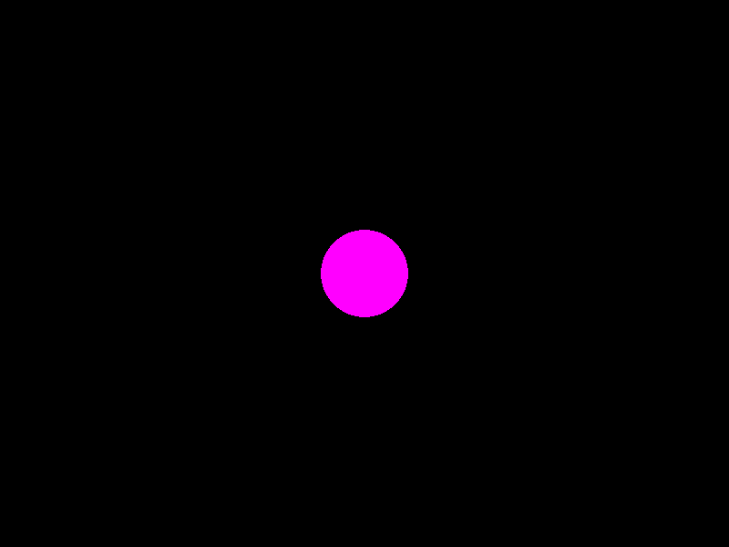
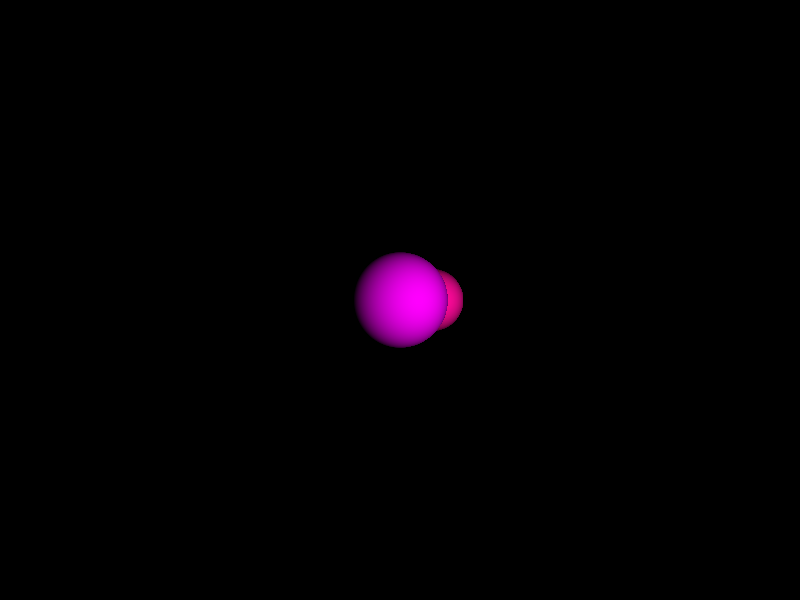
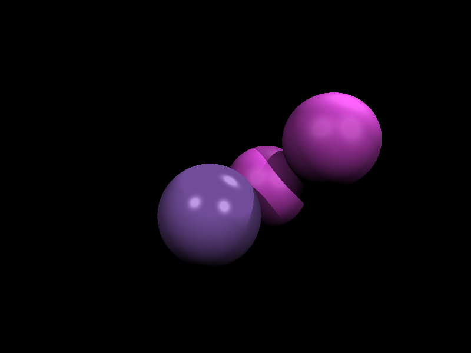
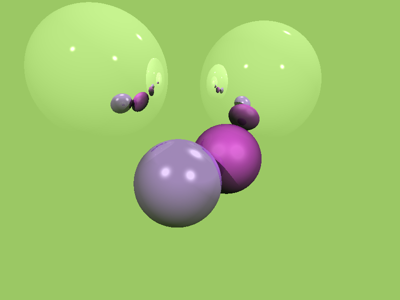
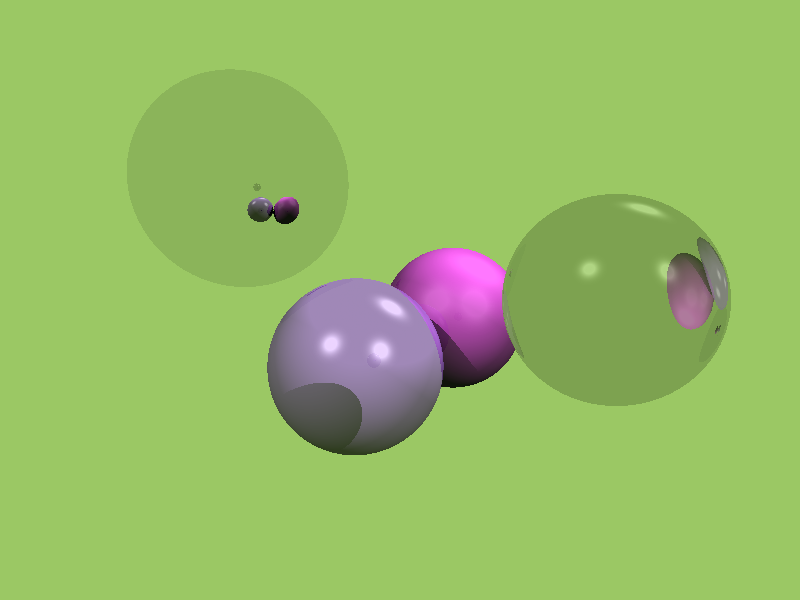
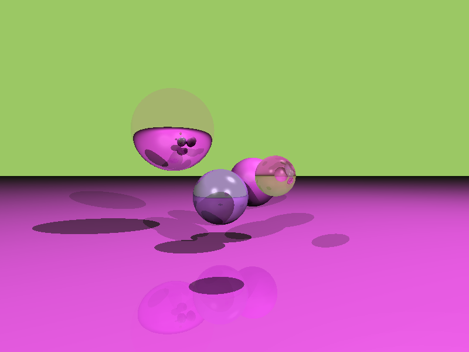
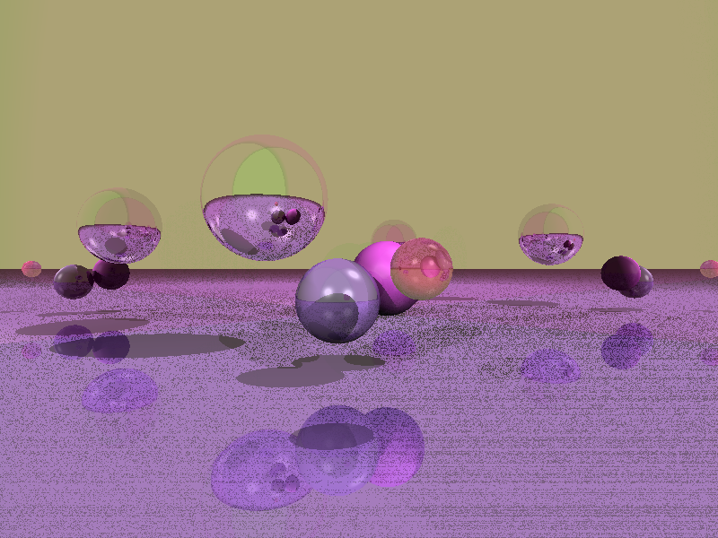

# rustracer

A toy raytracer built in rust.

## Progress

- [x] Single sphere

  

- [x] Scene (Multiple spheres)

  

- [x] Diffuse shading

  

- [x] Phong Shading (Single Light Source)

  .png)

- [x] Phong Shading (Multiple Light Sources)

  .png)

- [x] Shadows

  

- [x] Reflections

  

- [x] Refractions

  

- [x] Planes

  

  ### Showcase

## TODO

- [ ] Triangle meshes

- [ ] Transformations

- [ ] Textures

- [ ] Multisampling (to remove noise)

  

- [ ] Antialiasing
- [ ] Acceleration structures
- [ ] Compute shaders (probably Vulkan)